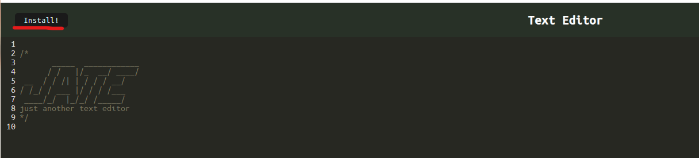
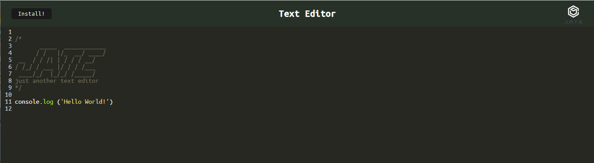

# Text Editor

# Table of Contents
* [Project description](#description)
* [How to install the app](#installation)
* [How to use the app](#usage)
* [License](#license)

# Project description
This is a text editor application, it runs in a browser and can be installed on a computer.

# How to install the app
* To use the code in the repository, after clone the repository, run "npm install", and then run "npm start"

* For front-end, click [This link](https://text-editor-kge.herokuapp.com/), and click the install button on the top-left corner

# How to use the app
This app is deployed in Heroku. 
* Click [The Text Editor URL](https://text-editor-kge.herokuapp.com/), a landing page will be presented.

* User can use this app on the browser directly, or use in the computer after the installation.

# License
MIT